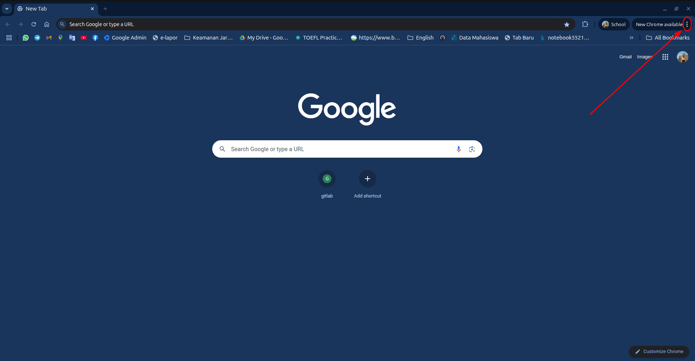
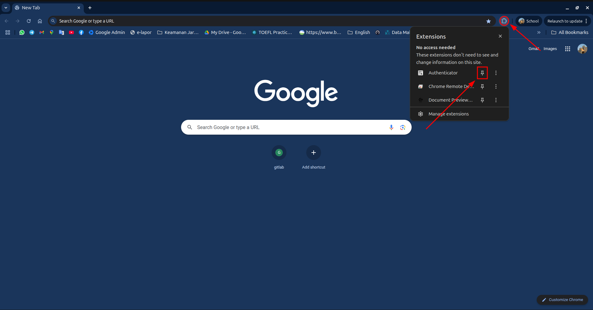
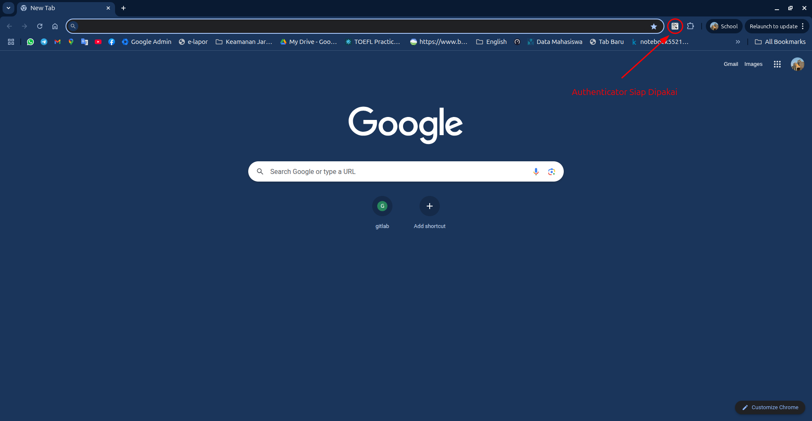

# Tutorial Instalasi Ekstensi Chrome Authenticator

Ekstensi **Authenticator** adalah alat yang wajib dimiliki untuk menghasilkan kode Two-Factor Authentication (2FA) langsung di browser Chrome Anda.

---

## Langkah 1: Buka Menu Chrome

1.  Buka *browser* Google Chrome Anda.
2.  Klik **ikon tiga titik** (menu More) di pojok kanan atas layar. (Ikon ini ditunjukkan oleh panah merah).

---

## Langkah 2: Akses Chrome Web Store

1.  Di menu yang muncul, arahkan kursor ke **Extensions** (Ekstensi).
2.  Dari sub-menu yang terbuka, klik **Visit Chrome Web Store**.

> **Catatan:** Ada dua gambar yang menunjukkan jalur ini. Gunakan yang paling jelas.

---

## Langkah 3: Cari Ekstensi "Authenticator"

1.  Setelah Chrome Web Store terbuka, cari kolom pencarian di bagian tengah atas.
2.  Ketik **`Authenticator`** dan tekan Enter.
3.  Klik pada hasil ekstensi **Authenticator** (biasanya yang pertama dan terverifikasi).

---

## Langkah 4: Tambahkan ke Chrome

1.  Di halaman detail ekstensi Authenticator, periksa deskripsinya.
2.  Klik tombol biru besar **`Add to Chrome`** (Tambahkan ke Chrome) di pojok kanan atas.
3.  Ikuti dialog konfirmasi yang muncul (klik "Tambahkan ekstensi").

---

## Langkah 5: Pin (Sematkan) Ekstensi untuk Akses Cepat

Setelah terinstal, ikon ekstensi sering tersembunyi. Ikuti langkah ini untuk membuatnya muncul permanen di *toolbar* Chrome:

1.  Klik **ikon *puzzle piece*** (potongan *puzzle*) di sudut kanan atas Chrome. Ini adalah **Menu Ekstensi**.
2.  Cari ekstensi **Authenticator** di dalam daftar yang muncul.
3.  Klik **ikon pin** (berbentuk paku payung) di samping nama **Authenticator** (ditunjukkan oleh panah merah).

### Hasil Langkah 5

Ikon Authenticator sekarang akan selalu terlihat di *toolbar* Chrome Anda, siap untuk diakses.

---

## Langkah 6: Ekstensi Siap Digunakan

Setelah di-*pin*, ikon Authenticator akan muncul secara permanen di *toolbar*. Sekarang ekstensi sudah **siap digunakan** untuk menambahkan akun *Two-Factor Authentication* (2FA) pertama Anda.

* Untuk mulai menambahkan akun, cukup klik ikon **Authenticator** yang sudah tersemat di *toolbar* Anda.

---